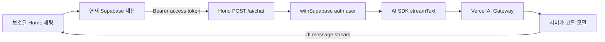

# Hono AI 채팅 명세

## 목표

별도 Vercel 프로젝트에 배포하는 Hono API와 Expo 모바일 앱을 Vercel AI SDK의 UI message stream으로 연결한다. 로그인한 사용자는 Home 화면에서 메시지를 보내고 생성되는 답변을 바로 볼 수 있다. 첫 버전은 연결과 스트리밍 검증에 집중하며 대화를 저장하지 않는다.

이 명세는 인증을 구현하지 않는다. `origin/main`의 모바일 인증 명세를 먼저 구현하고 검증한 뒤, 그 구현이 제공하는 Supabase 세션과 보호 경로를 사용한다.

## 선행 조건

- 구현 브랜치에는 `origin/main`의 [모바일 인증 명세](../mobile-authentication/spec.md)와 [모바일 인증 결정](../../decisions/mobile-authentication.md)이 포함되어 있어야 한다.
- 모바일 인증 명세의 로그인, 세션 복원, 보호 경로와 로그아웃이 구현되고 검증되어 있어야 한다.
- 인증 Provider는 현재 Supabase 세션을 앱 기능에서 읽을 수 있게 한다. 이 명세는 별도 로그인 상태나 토큰 저장소를 만들지 않는다.
- 모바일과 Hono API는 같은 Supabase 프로젝트를 사용한다.
- 로컬 canonical 저장소의 `apps/api/.env.local`에는 Git에서 제외된 `AI_GATEWAY_API_KEY`가 준비되어 있다.

선행 인증 구현의 공개 API나 route group 이름이 명세와 달라지면 그 실제 경계를 사용한다. 인증 기능을 복제하거나 우회해서 맞추지 않는다.

## 적용할 결정

- [AI 서버 경계](../../decisions/ai-server-boundary.md)
- [AI 모델 라우팅](../../decisions/ai-model-routing.md)
- [AI 채팅 프로토콜](../../decisions/ai-chat-protocol.md)
- [모바일 인증](../../decisions/mobile-authentication.md)
- [모바일 개발 런타임](../../decisions/mobile-development-runtime.md)
- [모바일 테스트와 런타임 검증](../../decisions/mobile-testing-and-verification.md)
- [Supabase 클라이언트 경계](../../decisions/supabase-client-boundaries.md)

## 요청 흐름



모바일은 모델 제공자를 알지 못한다. Hono는 현재 사용자를 확인한 뒤 서버 설정에 있는 모델을 호출하고 AI SDK 스트림을 그대로 모바일에 돌려준다.

## 필요한 최종 상태

### Hono API 앱

- `apps/api`는 모노레포 안의 독립 워크스페이스이며 Hono 앱을 기본 export한다.
- `apps/api`는 모바일 앱과 다른 Vercel 프로젝트에 연결한다.
- `GET /health`는 인증과 모델 호출 없이 `{ "status": "ok" }`를 반환한다. 이 경로는 배포와 서버 실행 상태만 확인한다.
- `POST /ai/chat`은 AI SDK UI message 형식의 메시지만 받는다.
- `POST /ai/chat`은 `@supabase/server/adapters/hono`의 `withSupabase({ auth: "user" })`를 경로에 직접 적용한다.
- 인증을 통과한 요청은 UI message를 모델 입력으로 바꾸고 `streamText()` 결과를 `toUIMessageStreamResponse()`로 반환한다.
- 요청 본문에 모델, 제공자, API key, system prompt 또는 도구 설정을 받지 않는다. 이 값은 서버가 소유한다.
- 본문 형식이 잘못되면 모델을 호출하지 않고 `400`을 반환한다.
- access token이 없거나 유효하지 않으면 모델을 호출하지 않고 `401`을 반환한다.
- 예상하지 못한 서버 오류는 비밀 값이나 제공자 원문 오류를 노출하지 않는 일반 오류 응답으로 반환한다.
- AI 경로는 `supabaseAdmin`을 사용하지 않는다.

### 서버 환경 변수

`apps/api/.env.example`은 실제 값 없이 다음 이름을 보여준다.

```dotenv
AI_GATEWAY_API_KEY=
AI_GATEWAY_MODEL=
SUPABASE_URL=
SUPABASE_JWKS_URL=
```

- `AI_GATEWAY_API_KEY`는 Hono 서버와 Vercel 프로젝트만 읽는다.
- `AI_GATEWAY_MODEL`은 구현할 때 AI Gateway의 최신 지원 목록에서 고른 `provider/model` 식별자다.
- `SUPABASE_JWKS_URL`은 Hono가 모바일 access token을 검증하는 같은 Supabase 프로젝트의 JWKS 주소다.
- 로컬 값은 `apps/api/.env.local`에 두고 Git에 넣지 않는다.
- Vercel의 Development, Preview와 Production 값은 해당 API 프로젝트에서 따로 설정한다.
- Supabase secret key를 나중에 추가하더라도 서버에만 둔다. 이번 AI 경로에는 필요하지 않으며 관리자 클라이언트를 만들 이유로 사용하지 않는다.

### 모델 호출

- 모델 호출은 Vercel AI Gateway를 거친다. 제공자별 SDK를 추가하지 않는다.
- 첫 모델 선택은 제품 기능이 아니라 바꿀 수 있는 서버 설정이다. 모바일 화면과 요청 형식은 모델이 바뀌어도 그대로 유지한다.
- 첫 채팅에는 제품별 system prompt, 도구 호출, 검색, RAG와 구조화 출력을 넣지 않는다.
- 자동 테스트는 실제 AI Gateway나 모델을 호출하지 않는다.

### 모바일 연결

- 인증 구현이 보호하는 Home 화면의 임시 HeroUI 체험 콘텐츠를 최소 채팅 화면으로 바꾼다.
- 채팅 화면은 메시지 목록, 텍스트 입력, 전송 동작, 응답 생성 중 상태와 다시 시도할 수 있는 오류를 제공한다.
- 모바일은 `@ai-sdk/react`의 `useChat()`으로 메시지 상태를 관리한다.
- 전송은 `expo/fetch`를 사용하고 API 기준 주소는 `EXPO_PUBLIC_API_URL`에서 읽는다.
- 각 요청은 인증 Provider의 현재 Supabase access token을 `Authorization: Bearer <token>`으로 보낸다. 앱 시작 때 읽은 토큰을 별도 상수나 저장소에 복사하지 않는다.
- 세션이 없으면 AI 요청을 보내지 않는다. 보호 경로 이동과 로그인 화면 표시는 선행 인증 구현이 담당한다.
- 메시지를 보내는 동안 같은 입력을 중복 전송하지 않는다.
- 생성되는 텍스트는 도착하는 순서대로 같은 assistant 메시지에 표시한다.
- 요청이 실패하면 이미 입력한 사용자 메시지를 유지하고 다시 시도할 수 있는 오류를 보여준다.
- 대화는 `useChat()` 메모리에만 둔다. 앱을 다시 시작하거나 Home 화면의 채팅 상태가 새로 만들어지면 대화가 사라진다.
- Activity, Saved, Settings와 인증 화면의 역할은 바꾸지 않는다.

`apps/mobile/.env.example`에는 다음 공개 설정 이름을 추가한다.

```dotenv
EXPO_PUBLIC_API_URL=
```

API 주소는 Simulator와 Emulator에서 실제로 접근할 수 있는 주소여야 한다. 로컬 주소와 배포 주소를 자동으로 바꾸는 별도 도구는 만들지 않는다.

### 테스트와 확인

- Hono 경로 테스트는 공식 `app.request()` 방식으로 실행한다.
- 서버 테스트는 공개 health 응답, 인증 없는 AI 요청 거절, 인증된 요청의 UI message stream 반환과 잘못된 본문 거절을 확인한다.
- 성공 경로는 가짜 모델을 사용한다. 자동 테스트에서 실제 AI Gateway 비용을 만들지 않는다.
- 모바일 컴포넌트 테스트는 가짜 전송 계층으로 사용자 메시지 전송, 생성 중 상태, 스트리밍 답변 표시와 오류 상태를 확인한다.
- 인증 화면과 제공자 로그인을 이번 컴포넌트 테스트에서 다시 검사하지 않는다. 선행 인증 명세의 테스트를 그대로 유지한다.
- Development Build에서는 먼저 선행 인증 흐름으로 로그인한다. 그 세션으로 iOS와 Android에서 각각 메시지 한 번과 스트리밍 답변 한 번을 확인한다.
- Vercel 배포에서는 `/health`와 로그인 사용자의 `/ai/chat` 요청을 확인한다.
- 루트의 `bun run check`, `bun run check-types`와 `bun run test`가 모두 통과해야 한다.

## 완료 조건

- `apps/api`가 독립 Hono 앱으로 실행되고 별도 Vercel 프로젝트에 배포된다.
- `/health`는 인증이나 AI Gateway 상태와 무관하게 서버 상태를 반환한다.
- access token이 없거나 잘못된 `/ai/chat` 요청은 모델을 호출하기 전에 `401`로 끝난다.
- 선행 인증 구현이 만든 유효한 Supabase 세션으로 `/ai/chat`을 호출하면 AI SDK UI message stream이 반환된다.
- 모바일 Home에서 보낸 메시지와 생성되는 답변이 iOS와 Android에 순서대로 표시된다.
- 모바일 요청에는 현재 Supabase access token이 들어가며 모델 식별자와 비밀 값은 들어가지 않는다.
- 앱을 다시 시작하면 이전 대화가 보이지 않으며 Supabase에 대화용 테이블이나 행이 생기지 않는다.
- 자동 테스트는 실제 모델을 호출하지 않고 서버와 모바일의 경계를 확인한다.
- Git 추적 파일과 모바일 번들에 AI Gateway key, Supabase secret key 또는 사용자 토큰이 없다.

## 가정

- 이 명세를 구현하기 전에 현재 브랜치와 `origin/main`을 합치고 모바일 인증 명세를 먼저 구현한다.
- 모바일 인증 구현은 현재 세션을 기능 코드에서 읽을 수 있는 안정적인 경계를 제공한다.
- Home의 기존 콘텐츠는 템플릿 확인용 임시 화면이므로 첫 AI 채팅 화면으로 바꿔도 된다. 실제 제품에서 다른 진입점이 정해지면 화면 위치만 바꿀 수 있다.
- 첫 모델은 구현 시점에 사용할 수 있는 비용이 낮은 텍스트 모델로 정한다. 선택 결과는 `AI_GATEWAY_MODEL` 설정에만 둔다.
- 첫 단계의 목적은 로컬과 Vercel에서 인증된 스트리밍 채팅 경로를 확인하는 것이다. 운영 서비스 수준의 비용과 남용 방지는 아직 요구하지 않는다.

## 이번 구현에서 제외할 범위

- 로그인 화면, Google·Apple·이메일 OTP, 세션 복원, 보호 경로와 로그아웃 구현
- 익명 로그인과 로그인 전 AI 체험
- 대화방과 메시지 테이블, 지난 대화 목록, 동기화와 스트림 재연결
- 사용자별 사용량, rate limit, Gateway 지출 한도와 자동 충전 설정
- 제품별 system prompt, 도구 호출, RAG, 검색, 첨부 파일과 구조화 출력
- 모델 선택 UI, 제공자 직접 연동, BYOK 선택과 fallback 순서
- 실제 모델을 호출하는 자동 평가와 새 E2E 도구
- Expo Web

## 미룬 내용

- 비용 제한은 실제 사용자에게 AI 기능을 열기 전에 별도 결정한다. 지금은 테스트 범위이므로 구현하지 않는다.
- 대화 저장은 앱을 다시 시작한 뒤 지난 대화를 이어야 한다는 제품 요구가 생길 때 정한다.
- 모델 품질, system prompt와 도구 구성은 이 연결 위에 올라갈 실제 AI 기능을 정할 때 다룬다.
- 로컬 API 주소 전환이 반복 문제로 확인되면 Simulator, Emulator와 실제 기기의 공통 개발 주소 방식을 별도로 정한다.

## 남은 위험

- 선행 인증 구현의 Provider API나 route group 구조가 달라지면 모바일 연결 지점을 실제 구현에 맞춰야 한다. 인증 상태를 중복해서 만들면 안 된다.
- `@supabase/server`는 Public Beta이며 Hono adapter와 환경 변수 이름이 바뀔 수 있다. 구현할 때 설치 버전의 문서와 타입을 다시 확인한다.
- `useChat()` API는 AI SDK 버전에 따라 자주 바뀐다. 구현할 때 설치한 `ai`와 `@ai-sdk/react`의 묶음 문서와 소스를 기준으로 작성한다.
- `expo/fetch` 스트리밍은 Jest만으로 보장할 수 없다. iOS와 Android Development Build 확인이 완료 증거에 포함된다.
- Vercel 프로젝트의 JWKS 주소나 Gateway 환경 변수가 잘못되면 코드 테스트가 통과해도 배포 요청은 실패한다.
- rate limit과 지출 한도를 미뤘으므로 이 상태를 불특정 사용자가 쓰는 운영 서비스에 그대로 공개하면 비용 남용 위험이 있다.

## 공식 근거

- [Hono Vercel 시작 안내](https://hono.dev/docs/getting-started/vercel)
- [Hono 테스트 안내](https://hono.dev/docs/guides/testing)
- [Vercel AI SDK 채팅 UI](https://ai-sdk.dev/docs/ai-sdk-ui/chatbot)
- [Vercel AI SDK UI message stream](https://ai-sdk.dev/docs/ai-sdk-ui/stream-protocol)
- [Vercel AI Gateway](https://vercel.com/docs/ai-gateway)
- [Supabase JWT와 JWKS](https://supabase.com/docs/guides/auth/jwts)
